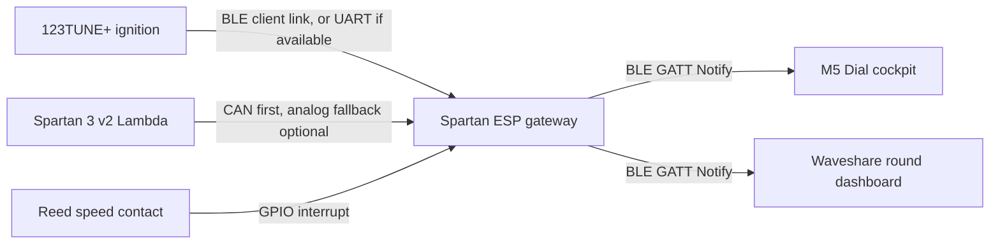

# Spartan BLE Gateway Architecture

## Goal

The Spartan ESP becomes the engine-bay data hub. It collects Lambda from the Spartan 3 v2, engine data from the 123TUNE+, and later wheel speed from a reed contact. Cockpit displays no longer need to know every sensor directly; they subscribe to the Spartan gateway.

## Recommended Order

1. Keep the current M5 direct-to-123TUNE+ mode as a fallback and debug mode.
2. Add a second M5 menu mode: `Spartan Gateway`.
3. Let the Spartan ESP advertise one combined BLE service for displays.
4. Add the 123TUNE+ intake on the Spartan ESP after the Lambda gateway is stable.
5. Add the reed speed input as a simple GPIO interrupt with debounce and calibration.
6. Bring CAN back in when the CAN transceiver hardware is available.

This makes BLE the practical first path and keeps CAN as the robust long-term sensor bus.

## BLE Roles

The Spartan ESP has two BLE jobs:

| Link | Spartan ESP role | Purpose |
| --- | --- | --- |
| `123TUNE+ -> Spartan ESP` | Central/client, unless UART is available | Read RPM, advance, MAP, temperature, voltage and other 123TUNE+ values |
| `Spartan ESP -> displays` | Peripheral/server | Publish combined cockpit data through Notify |

The M5 Dial and Waveshare display should only subscribe to the gateway in gateway mode. In direct mode, the M5 continues to connect straight to the 123TUNE+ as it does today.

## M5 Dial Menu Mode

Add a persistent setting on the M5:

| Mode | BLE target | Data available | Use case |
| --- | --- | --- | --- |
| `123 direkt` | 123TUNE+ | 123TUNE+ values only | Existing setup, debugging, driving before gateway is installed |
| `Spartan Gateway` | `Spartan3-Hub` | 123TUNE+, Lambda, speed, gateway status | Final cockpit mode with one source of truth |

The menu should show which mode is active and reconnect after a mode change.

## M5 Project Notes

Track these items in the M5 cockpit project:

| Item | Note |
| --- | --- |
| Connection setting | Add persistent mode enum: `DIRECT_123TUNE` or `SPARTAN_GATEWAY` |
| Direct mode | Keep the existing 123TUNE+ BLE target and decoder unchanged |
| Gateway mode scan | Prefer advertised name `Spartan3-Hub` plus service UUID match |
| Gateway mode fixed target | Optionally store the Spartan ESP BLE address after first pairing/selection |
| Status characteristic | Subscribe to `7f510002-5a6b-4d2a-9f20-14a7f3e20000` Notify |
| Reconnect behavior | On mode change, disconnect old target, clear stale values, scan/connect new target |
| Display labels | Show `123 direkt` or `Spartan Gateway` somewhere in the status/menu screen |
| Payload parser | Start with JSON for bring-up; later replace with a compact binary cockpit frame |
| Fallback | If gateway is missing, allow switching back to direct 123TUNE+ mode at the device |

The Spartan ESP publishes its current BLE address in the serial boot log and in the `/state` JSON as `ble_address`. The M5 should not depend only on the address during early testing, because ESP32 BLE address behavior can change with privacy/random-address settings. The robust first scan key is: advertised name `Spartan3-Hub` and service UUID `7f510001-5a6b-4d2a-9f20-14a7f3e20000`.

## Current Gateway Prototype

The `motorraum` firmware currently exposes this BLE peripheral:

| Item | Value |
| --- | --- |
| Advertised name | `Spartan3-Hub` |
| Service UUID | `7f510001-5a6b-4d2a-9f20-14a7f3e20000` |
| Status characteristic | `7f510002-5a6b-4d2a-9f20-14a7f3e20000`, read + notify |
| Command characteristic | `7f510003-5a6b-4d2a-9f20-14a7f3e20000`, write |
| Notify interval | 250 ms |

The status characteristic currently sends compact JSON with Lambda, temperature, Spartan status, data source and gateway status. This is useful for early M5/Waveshare bring-up. A later cockpit protocol should become a small binary frame so it is stable, fast, and independent of BLE MTU size.

## 123TUNE+ Intake

If the 123TUNE+ only provides BLE, the Spartan ESP must run as a BLE central/client toward it while also acting as a BLE peripheral/server for the displays. NimBLE on ESP32 can do both roles, but it must be tested together with WiFi because BLE and WiFi share the same radio.

If a real UART data stream from the 123TUNE+ is available, UART would be simpler for the gateway. Do not assume this path until the hardware/protocol is confirmed.

The existing M5 direct-client code is the best reference for the 123TUNE+ decoder. The gateway should reuse the same frame decoding so M5 direct mode and gateway mode show identical values.

## Reed Speed Input

Planned input:

| Signal | ESP32 handling |
| --- | --- |
| Reed contact | GPIO with pull-up, input protection and interrupt |
| Debounce | Ignore pulses inside a configurable minimum interval |
| Calibration | Pulses per wheel revolution or pulses per kilometer |
| Output | Speed and optionally distance/odometer in the gateway payload |

Because this will be mounted in a vehicle, add input protection before connecting a long wire to an ESP32 GPIO.

## Radio Caveats

For setup, WiFi AP + Web GUI is very useful. For cockpit operation, keep WiFi quiet when possible:

- Use WiFi mostly for setup and diagnostics.
- **Preferred (2026-06):** ESP-NOW broadcast for cockpit displays — see `docs/espnow-gateway-architecture.md`.
- BLE GATT notify remains available when `ENABLE_BLE_DISPLAY=1`, but multi-client BLE was unreliable in the car.

If wireless reliability is still not good enough, CAN remains the fallback for the wired sensor side.
