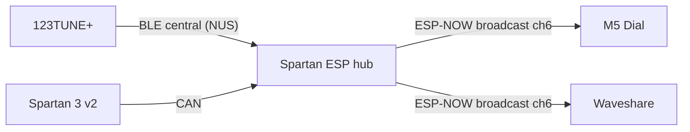

# Spartan ESP-NOW Gateway Architecture

## Why ESP-NOW for cockpit clients

BLE GATT with two or more display subscribers is fragile in a moving car: connections drop, scan/advertise competes with the 123TUNE+ central link, and WiFi AP setup traffic adds radio load.

ESP-NOW solves the multi-client case differently:

- One **broadcast** frame every 250 ms reaches every display without per-client GATT connections.
- Displays only **listen**; no pairing, no CCCD subscribe, no reconnect storms.
- The hub keeps **BLE central** only for 123TUNE+; display BLE peripheral mode is turned off in the `motorraum` build.



## Hub build flags (`motorraum`)

| Flag | Value | Meaning |
| --- | --- | --- |
| `ENABLE_BLE_HUB` | `1` | 123TUNE+ BLE central stays on |
| `ENABLE_BLE_DISPLAY` | `0` | No GATT server for M5/Waveshare |
| `ENABLE_ESP_NOW_HUB` | `1` | Cockpit broadcast enabled |
| `ESP_NOW_WIFI_CHANNEL` | `6` | Must match hub AP channel and display WiFi channel |

## Binary cockpit frame

Shared header: `include/spartan_cockpit_frame.h` (copy into M5/Waveshare firmware).

| Field | Type | Notes |
| --- | --- | --- |
| `magic` | `uint8_t` | `0x53` (`'S'`) |
| `version` | `uint8_t` | `1` |
| `seq` | `uint16_t` | Increments each frame |
| `lambda_x1000` | `uint16_t` | Lambda × 1000 |
| `rpm` | `uint16_t` | RPM |
| `advance_x10` | `int16_t` | Advance × 10 |
| `map` | `uint8_t` | MAP |
| `spartan_status` | `uint8_t` | Spartan status byte |
| `flags` | `uint8_t` | `0x01` lambda valid, `0x02` tune fresh, `0x04` tune connected |
| `crc8` | `uint8_t` | CRC-8 over preceding bytes |

Frame size: **14 bytes**. Validate with `spartanCockpitFrameValid()`.

## Display client checklist (M5 / Waveshare)

1. Add `spartan_cockpit_frame.h` to the cockpit project.
2. `WiFi.mode(WIFI_STA)` and fix channel: `esp_wifi_set_channel(ESP_NOW_WIFI_CHANNEL, WIFI_SECOND_CHAN_NONE)` (or connect briefly to `Spartan3-Setup` AP on channel 6).
3. `esp_now_init()` + `esp_now_register_recv_cb(...)`.
4. In recv callback: if `len == kSpartanCockpitFrameSize` and `spartanCockpitFrameValid(frame)`, update UI.
5. Remove BLE scan/connect/subscribe for `Spartan3-Hub` in gateway mode (keep direct 123TUNE mode unchanged).
6. Optional: show `seq` gaps as link quality hint.

## Hub diagnostics

`/state` JSON fields:

- `esp_now_ready`, `esp_now_channel`, `esp_now_tx`, `esp_now_tx_fail`, `esp_now_seq`
- `ble_display` — `false` when cockpit uses ESP-NOW

## Fallback

To revert to BLE display clients, set in `platformio.ini`:

```ini
-D ENABLE_BLE_DISPLAY=1
-D ENABLE_ESP_NOW_HUB=0
```

Re-test with two subscribers before relying on BLE in the car.
